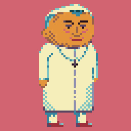
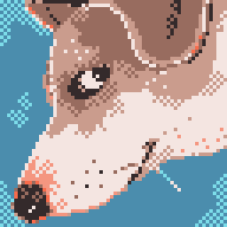
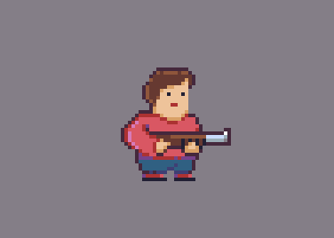
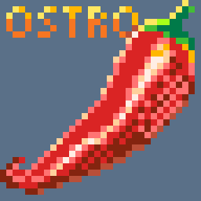
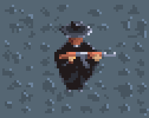
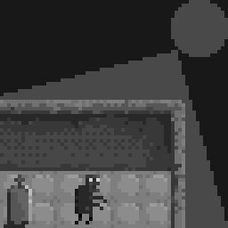
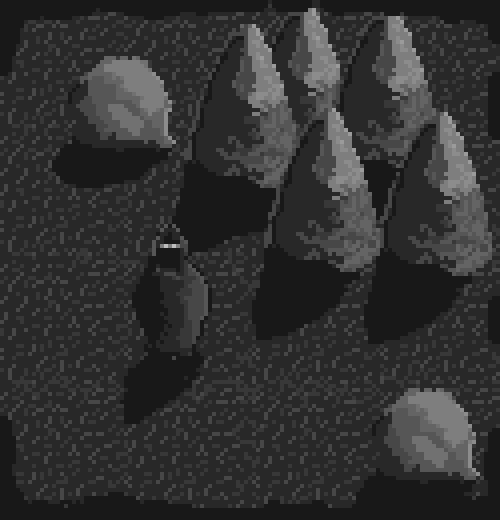
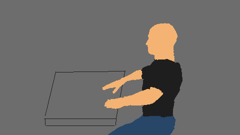
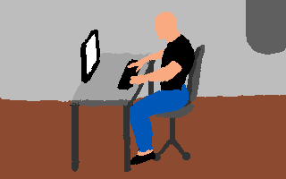
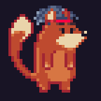

# 100 day new skills challenge 2024 🤝
A challenge to do pixel art/coding daily for 100 days.

## Rules

From **2024-08-14** every one of us (me & Karol) will do daily task (1 hour daily):

- @karolsykala will code
- @fedek6 will draw pixel art

## Loser

Loser will sponsor a good quality vegan sushi dinner for both of us.

## Progress Log

### Day 1

#### Karol

Read and practiced error catching in JS

#### Me

### Day 2

#### Karol

- Practiced JS OOP concepts, mainly classes

#### Me

### Day 3

#### Karol

- Started git course by https://github.com/ThePrimeagen

#### Me

### Day 4

#### Karol

- Finished around 50 % of the primagen Git course (setup and using git without any external programs to get to know git better)

#### Me

### Day 5

#### Karol

- Finished the Git course

### Me

- Started experimenting with custom non-restricted palettes & top down perspective

### Day 6

#### Karol

- Started a node.js course, after finishing that, there should be small github project that implements newly learned concepts

### Me

- Tile set study with light source 16x16

### Day 7

#### Karol

- continued to suffer with async js 

### Me

- Tile set speed paint concept 32x32 with light source

### Day 8

#### Karol

- read and practiced basics of node modules (Events, Error, Buffer, Fs)

#### Me

- Initial lineart for pixel art speed paiting called "so long łysy"

### Day 9

#### Karol

- Practiced using fs module and started reading about modular development with node.js

#### Me

- Silhouette for łysy

### Day 10

#### Karol

- Practiced readable and writable streams in node.js
  *As a bonus challenge I need to provide tommorow's log with a link to a node.js projects that should take couple of hours to make*

#### Me

- Speed painting, recreation of 90's point and click adventure game scene

### Day 11

#### Karol

- Practiced creating and using modules, started a practice project, failed to finish yesterday mini-challenge, so Konrad will be spoiled with Falafel 🥙

#### Me

- Added some details to łysy scene. No, Karol does not owe me any Falafel.

### Day 12

#### Karol

- Researched and set up data storage server to host databases that will be needed in upcoming projects

#### Me 

- Added some pixels to łysy scene (need to finish it before his farewell)
  
### Day 13

#### Karol

- Started a practice project, terminal maze solver game in node.js https://github.com/karolsykala/find-my-fedora

#### Me 

- Created 32px x 32px blue haired fox for Karol

### Day 14

#### Karol

- working on a terminal game, added main class and started working on game logic ([link](https://github.com/karolsykala/find-my-fedora/commit/1fa33b821527940e60261c7dab8071cf12f6a263)) 

#### Me

- Added some pixels to my Łysy artwork.

### Day 15

#### Karol

- Got stuck at implementic movement logic for the terminal game :c 

#### Me

- 
